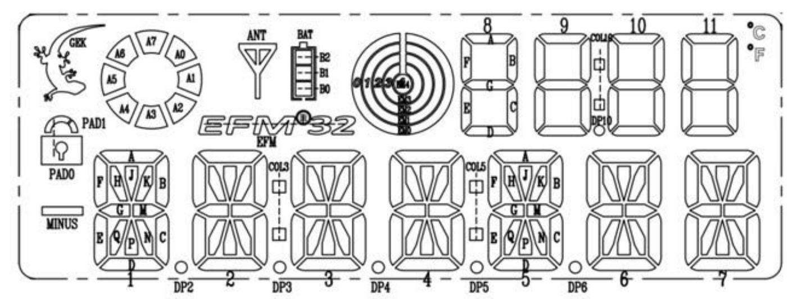

21  Using the LCD display
=========================

##A HAL for the LCD

This implements an HAL (hardware abstraction Layer) for the LCD on the STK3700 board. The STK3700 board has a 160 segment LCD display. It is multiplexed and user 20 segments pins and 8 common pins of the microcontroller. The onchip LCD controller can driver up to 288 segments using 8 common signals. It uses non standard voltages to get null average voltages to avoid electrolysis. See [AN0057.0: EFM32 Series 0 LCD Driver](https://www.silabs.com/documents/public/application-notes/AN0057.pdf)[38].

The layout of the LCD display is shown below.

The pins used are shown below.

Pin	| MCU Signal   |  LCD Signal
----|--------------|--------------
PA11  |	LCD_SEG39      |   S19
PA10  |	LCD_SEG38      |   S18
PA9	  |	LCD_SEG37      |   S17
PA8	  |	LCD_SEG36      |   S16
PA7	  |	LCD_SEG35      |   S15
PB2   |	LCD_SEG34      |   S14
PB1   |	LCD_SEG33      |   S13
PB0   |	LCD_SEG32      |   S12
PD12  |	LCD_SEG31      |   S11
PD11  |	LCD_SEG30      |   S10
PD10  |	LCD_SEG29      |   S9
PD9   |	LCD_SEG28      |   S8
PA6   |	LCD_SEG19      |   S7
PA5   |	LCD_SEG18      |   S6
PA4	  |	LCD_SEG17      |   S5
PA3	  |	LCD_SEG16      |   S4
PA2	  |	LCD_SEG15      |   S3
PA1	  |	LCD_SEG14      |   S2
PA0	  |	LCD_SEG13      |   S1
PA15  |	LCD_SEG12      |   S0
-	  |	-          |    -
PB6	  |	LCD_COM7       |    COM0
PB5	  |	LCD_COM6       |    COM1
PB4	  |	LCD_COM5       |    COM2
PB3	  |	LCD_COM4       |    COM3
PE7	  |	LCD_COM3       |    COM4
PE6	  |	LCD_COM2       |    COM5
PE5	  |	LCD_COM1       |    COM6
PE4	  |	LCD_COM0       |    COM7

Only two groups of segments pins are used: one between LCD12 and LCD19 and other, between LCD28 and LCD39. The LCD segments and the corresponding activation are show below. Note the reversal of numbering of the common lines.

LCD Map

Seg  | S0  | S1 | S2 | S3 | S4 | S5 | S6 | S7 | S8 | S9
-----|-----|----|----|----|----|----|----|----|----|----
COM0 | DP2 | 1E | 1D | 2E | 2D | 3E | 3D | 4E | 4D | DP5
COM1 | DP4 | 1Q | 1N | 2Q | 2N | 3Q | 3N | 4Q | 4N | 5E
COM2 | DP3 | 1P | 1C | 2P | 2C | 3P | 3C | 4P | 4C | 5Q
COM3 | COL3| 1G | 1M | 2G | 2M | 3G | 3M | 4G | 4M | 5P
COM4 | MIN | 1F | 1J | 2F | 2J | 3F | 3J | 4F | 4J | 5G
COM5 | PAD1| 1H | 1K | 2H | 2K | 3H | 3K | 4H | 4K | 5F
COM6 | GEK | 1A | 1B | 2A | 2B | 3A | 3B | 4A | 4B | 5H
COM7 | A7  | A6 | A5 | A4 | A3 | A2 | A1 | A0 | EFM| 5A

Seg  | S10 | S11| S12| S13| S14| S15| S16| S17| S18| S19
-----|-----|----|----|----|----|----|----|----|----|----
COM0 | 5D  | DP6| 6D | 7E | 7D | 11A| 10A| 9A | 8A | EM2
COM1 | 5N  | 6E | 6N | 7Q | 7N | 11F| 10F| 9F | 8F | EM4
COM2 | 5C  | 6Q | 6C | 7P | 7C | 11B| 10B| 9B | 8B | COL10
COM3 | 5M  | 6P | 6M | 7G | 7M | 11G| 10G| 9G | 8G | DP10
COM4 | 5J  | 6G | 6J | 7F | 7J | 11E| 10E| 9E | 8E | PAD0
COM5 | 5K  | 6F | 6K | 7H | 7K | 11C| 10C| 9C | 8C | EM3
COM6 | 5B  | 6H | 6B | 7A | 7B | 11D| 10D| 9D | 8D | EM1
COM7 | COL5| 6A | ANT| BAT| .C | .F | B1 | B0 | B2 | EM0

##API (Application Programming Interface)

The LCD display is divided in segments:

-   an alphanumerical field with 14 segments characters (position 1 to 7)
-   a numerical field with 7-segments digits (position 8 to 11)
-   a special field containing miscellaneous signs. Internally codified as positions 12 to 14.

The functions implemented are:

<dl>
<dt>uint32_t LCD_Init(void)</dt><dd>Initializes the LCD module. Set the LCD clock,
if not already set to default values</dd>
<dt>uint32_t LCD_Config(uint32_t presc, uint32_t div)</dt><dd>Configure and initializes the LCD
module</dd>
<dt>void LCD_WriteChar(uint8_t c, uint8_t pos)</dt><dd>Writes the char c into position pos.
Position is a number between 1 and 14.</dd>
<dt>void LCD_WriteString(char \*s)</dt><dd>Writes the string *s* into display.
The first 7 characters go into alphanumerical field (positions 1 to 7) and the next 4 character
 into the numerical field (position 8 to 11). The remaining characters are ignored.</dd>
<dt>void LCD_ClearAll(void)</dt><dd>Clear all segments.</dd>
<dt>void LCD_SetAll(void)</dt><dd>Lit all segments.</dd>
<dt>void LCD_WriteAlphanumericField(char \*s)</dt><dd>Writes the ASCII coded character in c
into position 1 to 7 (14-segments displays).</dd>
<dt>void LCD_WriteNumericField(char \*s)</dt><dd>Writes the ASCII coded digit in c into
position 8 to 11 (7-segments displays).</dd>
<dt>void LCD_SetSpecial(uint8_t c, uint8_t v)</dt><dd>Set the sign c coded as below according the
v parameter on (LCD_ON) or off (LCD_OFF).</dd>
</dl>

| Special signs encoding       ||
|------------------------|------|
|LCD_GECKO | Gecko in the upper left |
|LCD_MINUS | Minus in the left |
|LCD_PAD0  | Lower part of pad |
|LCD_PAD1  | Upper part of pad Z
|LCD_ANTENNA | Antenna |
|LCD_EMF32 | EFM32 Logo in the center |
|LCD_BAT0  | Battery level 0 |
|LCD_BAT1  | Battery level 1 |
|LCD_BAT2  | Battery level 2 |
|LCD_ARC0  | Arc segment 0 |
|LCD_ARC1  | Arc segment 1 |
|LCD_ARC2  | Arc segment 2 |
|LCD_ARC3  | Arc segment 3 |
|LCD_ARC4  | Arc segment 4 |
|LCD_ARC5  | Arc segment 5 |
|LCD_ARC6  | Arc segment 6 |
|LCD_ARC7  | Arc segment 7 |
|LCD_TARGET0 | Target circle 0 (external)|
|LCD_TARGET1 | Target circle 1 |
|LCD_TARGET2 | Target circle 2 |
|LCD_TARGET3 | Target circle 3 |
|LCD_TARGET4 | Target center |
|LCD_C       | Celsius sign |
|LCD_F       | Fahrenheit sign |
|LCD_COLLON3 | Collon at the left  of alphanumerical field |
|LCD_COLLON5 | Collon at the right of alphanumerical field |
|LCD_COLLON10 | Collon in the middle of the numerical field |
|LCD_DP2  | Decimal point left of character at position 2 |
|LCD_DP3  | Decimal point left of character at position 3 |
|LCD_DP4  | Decimal point left of character at position 4 |
|LCD_DP5  | Decimal point left of character at position 5 |
|LCD_DP6  | Decimal point left of character at position 6 |
|LCD_DP10 |  Decimal point in the middle of the numerical field |
| For the encoding below the parameter v is the value to set | range  |
|LCD_ARC  | 0 to 7 |
|LCD_BATTERY | 0 to 2 |
|LCD_LOCK    | 0 to 1 |
|LCD_TARGET  | 0 to 5 |

##Implementation

A multistep approach to display a character in a certain position is used. It uses many tables:

-   Segments for characters for 14 and 7 segment displays.
-   Controller segment and common numbers to display a display segment in a certain position
-   Controllers segments for all common signal that must be cleared before displaying a segment in a certain position.

The tables are consulted in order show above. To write a new char, a sequence of 8 write operations is needed, because the position must be cleared.

##More information

[Example code for Segment LCD on EFM32 Giant Gecko development kit EFM32GG-DK3750 (Without using Emlib)](http://embeddedelectrons.blogspot.com.br/2016/12/example-code-for-segment-lcd-on-efm32.html)[39]
[Segmented LED Display - ASCII Library](https://github.com/dmadison/LED-Segment-ASCII)[40]
[AN0009: EFM32 and EZR32 Series Getting Started](http:////www.silabs.com/documents/public/application-notes/an0009.0-efm32-ezr32-series-0-getting-started.pdf)[41]
[AN0057.0: EFM32 Series ](https://www.silabs.com/documents/public/application-notes/AN0057.pdf)[f](https://www.silabs.com/documents/public/application-notes/AN0057.pdf)[0 LCD Driver](https://www.silabs.com/documents/public/application-notes/AN0057.pdf)[42]
