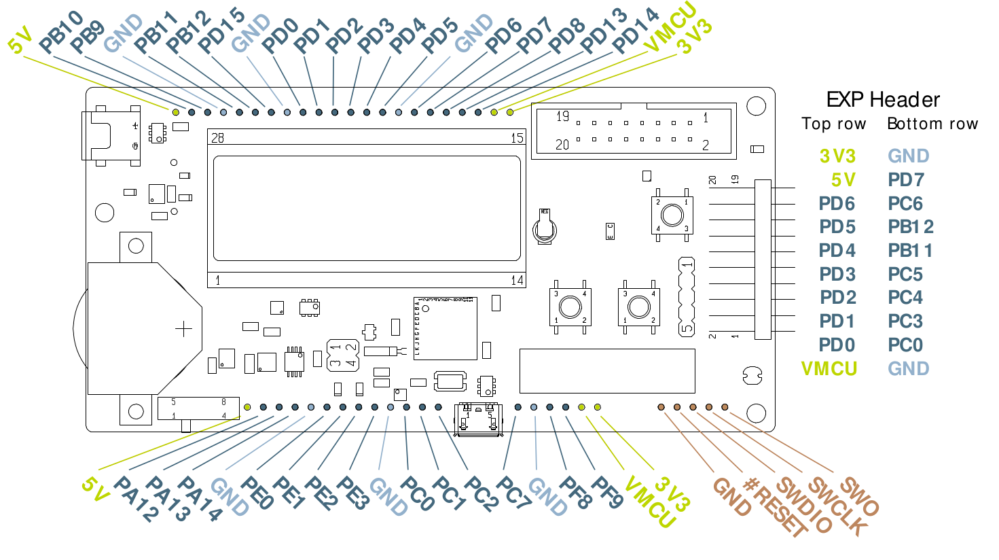

22 Quadrature encoder
=====================

# Introduction

To get the movement of a rotation axis, the most common way is to use a quadrature encoder. It consists of a disk with two series of holes, and a 90 degree phase difference.

Using two sensores, A and B, one for each serie, the sensors signals are generated when the disk rotates clockwise.
When it rotates couterclockwise, the waveforms below are generated.

With this information, it is possible to detect the direction of rotation and the amount rotated. One colateral benefit is the quadruplication of resolution when sensing the change of sensor information. So, a disk with 100 slots generates 400 changes of A and B pro revolution. The resolution changes from 3,6 degrees to 0,9 degrees.

There are many possibilites to process this sensor information. From dedicated hardware to pure software solution.
Among them, the following approaches are relevant for the EFM32GG:

* GPIO with polling
* GPIO with interrupt
* TIMER 
* PCNT

# GPIO with polling

By reading continuously the A and B signals, it is possible to detect and count the transitions. This behavior can be show as a state diagram.

In the above diagram, it is shown how the counter must react to each input valu, i.e. A and B values. The same input value can trigger different counting sequences, depending on an internal state. The outputs are composed of two signals. One is the counting pulse and other is the direction (up or down). Note that in the diagram certain invalid values, that corresponds to a too fast variation of the disk are ignored. In some cases, like robotics, these values must trigger an error condition, because there is a loss of control of what is happening. In other cases, like panels, these can be ignored until a meaningful value is detected.

    typedef enum { Q0, Q1, Q2, Q3 } state_t;
    
    static state_t state = Q0;  /* initial state */
    
    static int counter = 0;     /* counter */
    #define X00   0
    #define X01   1
    #define X10   2
    #define X11   3
    
    void 
    processquadrature(unsigned ab) {
    
        switch(state) {
        case Q0:
            if( ab == X01 ) {
                state = Q1;
                counter++;
            } else if ( ab == X10 ) {
                state = Q3;
                counter--;
            }
            break;
        case Q1:
            if( ab == X11 ) {
                state = Q2;
                counter++;
            } else if ( ab == X00 ) {
                state = Q0;
                counter--;
            }
            break;
        case Q2:
            if( ab == X10 ) {
                state = Q3;
                counter++;
            } else if ( ab == X01 ) {
                state = Q1;
                counter--;
            }
            break;
        case Q3:
            if( ab == X10 ) {
                state = Q0;
                counter++;
            } else if ( ab == X11 ) {
                state = Q2;
                counter--;
            }
            break;
        }
    }

    int main() {
    unsigned reading;

        while(1) {
            reading = readquadrature();
            processquadrature(reading);
            ...
        }
    }

A variation of this approach uses a periodic interrupt and frees the CPU avoiding constant reading of the inputs. The frequency of this interrupt $'f_{int}'$ must be greater than the maximal frequency of one of the signals A or B.

f_{int} >= slots*w*60$$, 

where w is the maximal rotational speed of the encoder and slots, the number of slots for each revolution.

    static int counter = 0;     /* counter */

    void TimerX_IRQ(void) {
    unsigned reading;    
        reading = readquadrature();
        processquadrature(reading);
    }

# GPIO with interrupts

There are basically two ways of using the GPIO interrupts:

* Interrupt at every change of A and B
* Interrupt at falling edge of A

When using the interrupt at every change of A and B, the function *processquadrature* above can be called at each interrupt.

The other possibility is to have an interrupt at each falling edge of A and the inspects B. Observing the waveforms above, when B is high, it is a direct movement and when B is low, it is a reverse movement. By using only one transition, the resolution is only specified by the number of slots in each serie.

# Timers

The EFM32GG microcontroller has four timers (TIMx) that can be used to decode and count.

The timers have three input channels. To decode quadrature signals, the channels 0 and 1 are used and must be connected to the A and B output of the encoder. There are two modes of counting as defined by the QDN bit in the TIMERx_CTRL register. One is the X4 mode, that counts on every transition of A and B and the other, X2, only counts when there is a change in the A channel. In every case, the counter has 16 bits.

Mode    |  Resolution
--------|-------------
X4      |  4*slots
X2      |  2*slots

# Pulse counter

The EMF32GG microcontroller has three Pulse Counters (PCNTx). 
The pulse counters 0 (PCNT0) has a 16 bit counter and the other two (PCNT1 and PCNT2) have 8-bit counters. They have two inputs, S0IN and S1IN, that must be connected to A and B.

# Using the EFM32GG-STK3700 board

The following signals are available at the connectors. 

OBS: ARD Pin Numbers are numbered from 1 to 22 reading with the board with EXP connector to the right.

Signal | Connector               | Pin  | Connector            | Pin
-------|-------------------------|------|----------------------|--------
PD0    | EXP Header Top          | 4    | ARD Breakout Pad Top | 9
PD1    | EXP Header Top          | 6    | ARD Breakout Pad Top | 10
PD2    | EXP Header Top          | 8    | ARD Breakout Pad Top | 11
PD3    | EXP Header Top          | 10   | ARD Breakout Pad Top | 12
PD4    | EXP Header Top          | 12   | ARD Breakout Pad Top | 13
PD5    | EXP Header Top          | 14   | ARD Breakout Pad Top | 14
PD6    | EXP Header Top          | 16   | ARD Breakout Pad Top | 16
PD7    | EXP Header Bottom       | 17   | ARD Breakout Pad Top | 17
PC6    | EXP Header Bottom       | 15   |
PB12   | EXP Header Bottom       | 13   |
PB11   | EXP Header Bottom       | 11   |
PC5    | EXP Header Bottom       | 9    |
PC4    | EXP Header Bottom       | 7    |
PC3    | EXP Header Bottom       | 5    |
PC0    | EXP Header Bottom       | 3    | ARD Breakout Bottom  | 11
PB10   | ARD Breakout Pad T      | 2    |
PB9    | ARD Breakout Pad Top    | 3    |
PB11   | ARD Breakout Pad Top    | 2    |
PB12   | ARD Breakout Pad Top    | 2    |
PD15   | ARD Breakout Pad Top    | 2    |
PD13   | ARD Breakout Pad Top    | 19   |
PD8    | ARD Breakout Pad Top    | 18   |
PD14   | ARD Breakout Pad Top    | 20   |
PA12   | ARD Breakout Pad Bottom | 2    |
PA13   | ARD Breakout Pad Bottom | 3    |
PA14   | ARD Breakout Pad Bottom | 4    |
PE0    | ARD Breakout Pad Bottom | 2    |
PE1    | ARD Breakout Pad Bottom | 2    |
PE2    | ARD Breakout Pad Bottom | 2    |
PE3    | ARD Breakout Pad Bottom | 2    |
PC1    | ARD Breakout Pad Bottom | 12   |
PC2    | ARD Breakout Pad Bottom | 13   |
 -     |    -                    | -    |
PC7    | ARD Breakout Pad Bottom | 14   |
PF8    | ARD Breakout Pad Bottom | 16   |
PF9    | ARD Breakout Pad Bottom | 17   |

There are pins for different voltage sources and ground

Voltage |   Connector         | Pin
--------|---------------------|----------
5V      | EXP Header Top      | 18
        | ARB Breakout Top    | 1
        | ARB Breakout Bottom | 1
3V3     | EXP Header Top      | 20
        | ARB Breakout Top    | 22
        | ARB Breakout Bottom | 19
VMCU    | EXP Header Top      | 2
        | ARB Breakout Top    | 21
        | ARB Breakout Bottom | 18
GND     | EXP Header Bottom   | 1
        | EXP Header Bottom   | 19
        | ARB Breakout Top    | 4
        | ARB Breakout Top    | 8
        | ARB Breakout Top    | 15
        | ARB Breakout Bottom | 5
        | ARB Breakout Bottom | 9
        | ARB Breakout Bottom | 14

To use GPIO based methods, only connect the A and B signals to some GPIO port. When using interrupts, it must be observed than all GPIO Pin 10 generates a EXT10 interrupt.

From the datasheet, there are the possibilities below to connect A and B to the TIMER.

TIM Signal |     |      |     |     |     |    |    Description
-----------|-----|------|-----|-----|-----|----|-----------------------
TIM0_CC0   | PA0 | PA0  | PF6 |**PD1**| PA0 | PF0| Timer 0 Capture Compare input / output channel 0
TIM0_CC1   | PA1 | PA1  | PF7 |**PD2**| PC0 | PF1| Timer 0 Capture Compare input / output channel 1
TIM1_CC0   |     | PE10 | PB0 | PB7 |**PD6**|    | Timer 1 Capture Compare input / output channel 0
TIM1_CC1   |     | PE11 | PB1 | PB8 |**PD7**|    | Timer 1 Capture Compare input / output channel 1
TIM2_CC0   | PA8 |**PA12**| PC8 |     |     |    | Timer 2 Capture Compare input / output channel 0
TIM2_CC1   | PA9 |**PA13**| PC9 |     |     |    | Timer 2 Capture Compare input / output channel 1
TIM3_CC0   | PE14|**PE0** |     |     |     |    | Timer 3 Capture Compare input / output channel 0
TIM3_CC1   | PE15|**PE1** |     |     |     |    | Timer 3 Capture Compare input / output channel 1

The pins signaled are available on the connectors.

From the datasheet one can see the following alternatives por PCNT

PCNT Signal| Pin   |       |     |     |  Description
-----------|-------|-------|-----|-----|-----------------------------
PCNT0_S0IN |       |**PE0**|**PC0**|**PD6**| Pulse Counter PCNT0 input number 0
PCNT0_S1IN |       |**PE1**|**PC1**|**PD7**| Pulse Counter PCNT0 input number 1
PCNT1_S0IN |**PC4**| PB3 |     |     | Pulse Counter PCNT1 input number 0
PCNT1_S1IN |**PC5**| PB4 |     |     | Pulse Counter PCNT1 input number 1
PCNT2_S0IN |**PD0**| PE8 |     |     | Pulse Counter PCNT2 input number 0
PCNT2_S1IN |**PD1**| PE9 |     |     | Pulse Counter PCNT2 input number 1

#References

[EMF32GG Reference Manual](https://www.silabs.com/documents/public/reference-manuals/EFM32GG-RM.pdf)

[EFM32GG990 Data Sheet](https://www.silabs.com/documents/public/data-sheets/efm32gg-datasheet.pdf)

[AN0021](https://www.silabs.com/documents/public/application-notes/AN0021.pdf)

