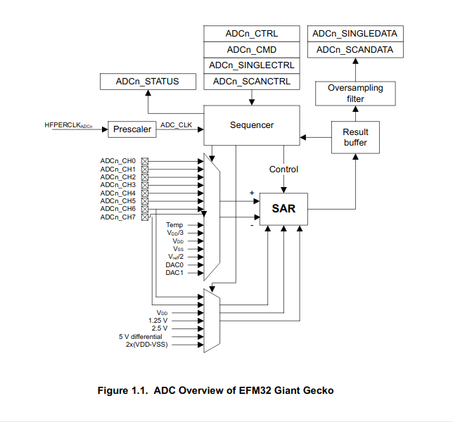

22 Temperature
===============

#ADC Converters

The EFM32GG99 is part of the EMFG32 Gecko Series 0 Family. The members of this family have a 12-bit SAR (Successive Approximation Register) ADC (Analog-Digital Converter).

The ADC has 15 channels, 8 external and 6 internals channels.

Channel| Signal       |  Input
-------|--------------|---------
0      | CH0          | External
1      | CH1          | External
2      | CH2          | External
3      | CH3          | External
4      | CH4          | External
5      | CH5          | External
6      | CH6          | External
7      | CH7          | External
8      | Temperature  | Internal
9      | VDD/3        | Internal
10     | VDD          | Internal
11     | VSS          | Internal
12     | Vref/2       | Internal
13     | DAC0         | Internal
14     | DAC1         | Internal

The 8 external signals can be used as differential pairs

Channel    | Positive Signal  | Negative Signal  |
-----------|------------------|------------------|
CH0_1      |     CH0          |      CH1         |
CH2_3      |     CH2          |      CH3         |
CH4_5      |     CH4          |      CH5         |
CH6_7      |     CH6          |      CH7         |

For the conversion, a stable reference voltage is neccessary. THere are the options shown bellow.

Reference Voltage| Notes             |  Single/Differential |
-----------------|-------------------|----------------------|
V_DD             | internal buffered | Single/Differential  |
1.25 V           | internal          |    Single            |
2.5 V            | internal          |    Single            |
5 V differential | internal          |  Differential        |
EXTSINGLE        | external (CH6)    |    Single            |
2xEXTDIFF        | external (CH6-CH7)|  Differential        |
2xVDD            | unbuffered        |  Differential        |

There are basically two modes of operation:

* Single Sample. Each conversion must be started by a command
* Scan mode. A set of conversions is started by a command 

# Timing

A conversion takes TCONV = (TA+N)xOSR cycles, where TA is the acquisition time, N, the number of bits and OSR, the oversampling factor.

The duration of a cycle depends on the clock source used and the prescaler factor. The clock source is the Peripheral CLock HFPERCLK, shared with many other peripherals. The prescaler value is in the range between 1 and 128. But the clock frequency must be greater than 32 KHz and less than 13 MHz.

The is also an automatic warm up time after enabling the ADC or changing the reference voltage. It is a 1 us, plus an additional 5 us if an internal reference (bandgap)  voltage is used (1.25 or 2.5 V).

There are 4 different warm-up modes:

* NORMAL: The ADC and reference voltage are shut off when there is no samples waiting.
* FASTBG: No warm up for the voltage reference but the accuracy is reduced. 
* KEEPSCANREFWARM: The bandgap reference is kept warm during a scan. But there there must be a warm up before starting another scan. Only for bandgap reference voltage.
* KEEPADCWARM: The ADC and the bandgap reference are kept warm for a scan. Only for bandgap reference voltage.

The warmup is done automatically by the ADC, when the correct number of clock cycles is written in the TIMEBASE field of ADC0_CTRL. The number of cycles must correspond to, at least, a 1 us delay.

There are bits in the ADC_STATUS register, that gives information about the warm-up status.

Bit           | Symbol                      | Description
--------------|-----------------------------|-----------------------------------------------
WARM          | ADC_STATUS_WARM             | ADC is warmed up when 1
SCANREFWARM   | ADC_STATUS_SCANREFWARM      | Reference is warmed up for scan mode when 1
SINGLEREFWARM |  ADC_STATUS_SINGLEREFWARM   | Reference is warmed up for single mode when 1

#Temperature measurement

The Channel 8 is connected to a internal temperature sensor. This sensor is calibrated  during manufacturing and the calibration parameters are written to a ROM area, called Device information (DI) page.

To get the temperature it is neccessary to use the following formula.

T_Celsius = CAL_TEMP_0 - (ADC0_TEMP_0_READ_1v25 - ADC_Result) x Vref/(4096 x TGRAD_ADCTH)

The CAL_TEMP_0 and ADC0_TEMP_0_READ_1v25 values can be found in the DI page (See bellow).

The TGRAD_ADCTH can be found on the device datasheet.

Value    |  Units   |
---------|----------|
-1.92    |  mV/C    |
-6.3     |  units/C |

# Calibration

During manufacturing a set of additional information are written in the DI page, that can be used to calibrate the measurements.

Name                   |   Address      |   Information                      |  Size   |
-----------------------|----------------|------------------------------------|---------|
ADC0_CAL               |   0x0FE08040   |  ??                                |   32    |
ADC0_BIASPROG          |   0x0FE08058   |  ??                                |   32    |
CAL_TEMP_0             |   0x0FE081B2   |  Calibration temperature (7:0)     |   16    |
ADC0_CAL_1V25          |   0x0FE081B4   |  Gain (14:8) / Offset (6:0)        |   16    |
ADC0_CAL_2V5           |   0x0FE081B6   |  Gain (14:8) / Offset (6:0)        |   16    |
ADC0_CAL_VDD           |   0x0FE081B8   |  Gain (14:8) / Offset (6:0)        |   16    |
ADC0_CAL_5VDIFF        |   0x0FE081BA   |  Gain (14:8) / Offset (6:0)        |   16    |
ADC0_CAL_2xVDD         |   0x0FE081BC   |  Gain (14:8) / Offset (6:0)        |   16    |
ADC0_TEMP_0_READ_1V25  |   0x0FE081BE   |  Temperature reading (15:4)        |   16    |

The values should be accessed using the DEVINFO structure as seen in efm32gg_devinfo.h. But there is inconsistency between the info in the reference manual and the structure defined in the source code.

So, to get a value, one should use the following code

    uint16_t val16 =  *( (uint16_t *) address )
    uint32_t val32 =  *( (uint32_t *) address )

Or define them as macros

    #define  GET16(ADDR)      *( (uint16_t *) (ADDR) )
    #define  GET32(ADDR)      *( (uint32_t *) (ADDR) )
    ...
    uint16_t val16 = GET16(address);
    uint16_t val16 = GET16(address);

During reset, the values for 1V25 are automatically written in ADC0_CAL register. The values for calibration (ADC0_CAL_*)  must be written to the ADC0_CAL register in order the ADC module automatically corrects the value read.

#Implementation

TBD

#References

[EMF32GG Reference Manual](https://www.silabs.com/documents/public/reference-manuals/EFM32GG-RM.pdf)

[EFM32GG990 Data Sheet](https://www.silabs.com/documents/public/data-sheets/efm32gg-datasheet.pdf)

[AN0021](https://www.silabs.com/documents/public/application-notes/AN0021.pdf)

